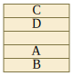
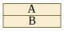
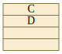
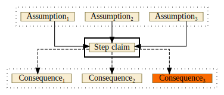

---
# Feel free to add content and custom Front Matter to this file.
# To modify the layout, see https://jekyllrb.com/docs/themes/#overriding-theme-defaults

layout: page
title: Introduction
---

# Introduction to VizAR

### Clause visualization

#### Clauses as sequents

ATP proofs consist of clauses with positive and negative literals.
In the VizAR syntax, clauses are displayed as _sequents_ in order to avoid the
negation sign (`~` in TPTP).

For example, the clause 

```
A | B | ~C | ~D
``` 

is considered as the logically equivalent sequent:

```
C, D => A, B
```

The antecedents (left-hand side) are implicitly connected by logical _and_, while
the consequents (right-hand side) are implicitly connected by _or_.
The sequents are visualized vertically as follows.



Clauses without negative literals (for example `A | B`) are displayed simply as:



Clauses without positive literals (for example `~C | ~D`) are displayed as:



A unit clause with one negative literal is written as `¬ A` instead of `A => ⊥`
to save space.
This is the only case where the negation sign can be encoutered.
Moreover, we write `s ≠ t` instead of `¬ (s = t)`.

#### Type annotations

First-order translation of Mizar statements typically use predicates (type
guards) to denote type of variables.
For example:

```
natural(X1), natural(X2) => natural(plus(X1,X2))
```

To simplify the presentation, VizAR discards the type guards applied to
variables, and introduces a different variable symbols for each type predicate,
for example, `N` for natural numbers.
Hence the above sequent becomes just `natural(plus(N1,N2))`.
Furthermore, VizAR uses unicode symbols to beautify clauses and in the end you
will see simply `N₁ + N₂ ∈ ℕ`.

The list of currently supported variable symbols is given in the following table.

<table>
   <tr>
      <th>variable</th>
      <th>ATP symbol</th>
      <th>Mizar symbol</th>
      <th>domain</th>
      <th>description</th>
   </tr>



   
   <tr>
      <td>{{var.variable}}</td>
      <td>{{v}}</td>
      <td><a href="{{var.url}}" target="_mizar">{{var.mizar}}</a></td>
      <td>{{var.domain}}</td>
      <td>{{var.desc}}</td>
   </tr>



</table>

For example, the statement `N₁ ∈ ℝ` should be interpreted as "Every
natural number is a real number".

Moreover, all negative occurrences of type guard predicates (even with a
non-variable argument) are completely avoided from displaying.
This is because they usually provide no interesting information from the
human point of view.
Note that positive occurrences are left intact, otherwise, for example, when
assuming that `√2` is irrational, the whole assumption would be discarded.

### Available proof views

VizAR provides several ways to investigate ATP proofs.

#### Full proof view

In the full proof view the whole proof is displayed as an directed acyclic
graph as an SVG image with hyperlinks.
The leaves correspond to assumptions (displayed blue) and all the edges can be
followed to the final node representing the contradiction `⊥`.
Clicking on any node will take you to a detailed description of the
corresponding proof step.

#### Conjecture-centered view

Since the full proof view might be very complex, VizAR features a
conjecture-centered view where only the statements derived from the conjecture
are displayed.
This is a subgraph of the full proof view and the conjecture-derived nodes are
displayed orange.
Additionally, for every conjecture-related node, its non-conjecture premises
used to derive this step are displayed.

This view can help you to inspect how the negation of the proved claimed is
transformed into the contradiction.
Hence it can be useful to identify the key steps of the proof.

#### Proof step view

In the proof step view, only a single proof graph node is displayed with its
immediate parents and children.
Additional information are provided about the symbols appearing in this proof
step.
The proof step is visualized as follows.



Here the assumptions are all the premises needed to derive the claim of this step.
The consequences are all future proof steps where the current claim is used as
one of the premises.

Again, you can click on any of nodes and this takes you to the corresponding
proof step view.
Clicking on the consequences will inevitable take you to the contradiction while
clicking on the assumptions will take you to one of the axioms (or to the
conjecture if you follow orange nodes).

### Skolem symbols

Skolem symbols are introduced by ATPs to eliminate existential quantifiers.
In VizAR, they are named as `sk₁`, `sk₂` and so on.
Skolem symbol names are specific to each proof.
It is important to understand their meaning and, to help you with that, VizAR
displays their origin in the proof overview.
Clicking on the axiom will take you to the axiom view where you will also see
the original formula that gave rise to them.
Investigate the Skolem symbols before diving into the proof.
The Skolem symbols are also displayed in the proof step view, when the claim
contains some of them.

